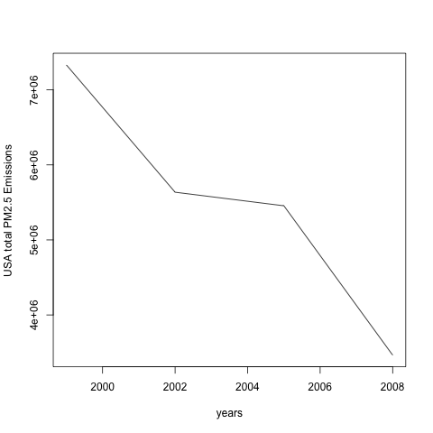
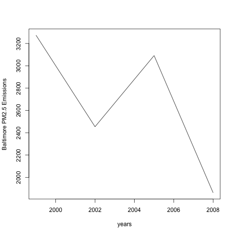
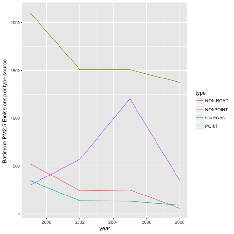
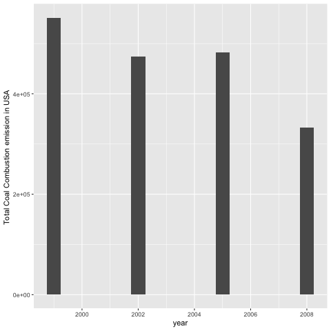
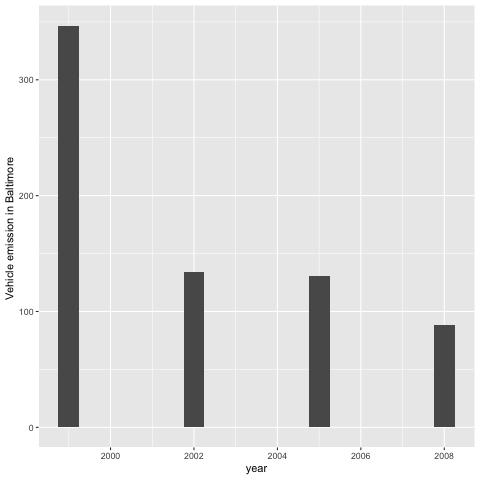
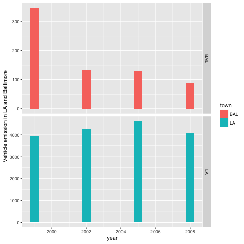

#Information for reviewers, course project 2
##This repository contains: 

* Six R codes to plot the six analysis asked in the assignment, they assume the PM2.5 Emissions dataset is installed in the working directory

* Six png plots

* The README with copy-paste of R codes and answers to the appropriate point in the peer assessment.

##Answers and Conclusions from PM2.5 emissions analysis

All Questions need first to load the dataset and install it in the working directory
```{r}
#read data
NEI <- readRDS("summarySCC_PM25.rds")
SCC <- readRDS("Source_Classification_Code.rds")
```
### Question 1:
Have total emissions from PM2.5 decreased in the United States from 1999 to 2008? Using the base plotting system, make a plot showing the total PM2.5 emission from all sources for each of the years 1999, 2002, 2005, and 2008.
### Answer
The R function aggregate gives directly the sum of all emissions ordered per year
```{r}
Emissions <- aggregate(NEI[, 'Emissions'], by=list(NEI$year), FUN=sum)
```
We plot the result 
```{r}
plot(Emissions,type="l",xlab="years",ylab="USA total PM2.5 Emissions")
```
The plot shows a global decrease for USA total PM2.5 Emissions between 1998 and 2008 



### Question 2:
Have total emissions from PM2.5 decreased in the Baltimore City, Maryland (fips == "24510") from 1999 to 2008? Use the base plotting system to make a plot answering this question.
### Answer
We first restrict data to baltimore City, fips 24510
```{r}
#restriction 
ID1=which(NEI[,"fips"]=="24510")
NEI2=NEI[ID1,]
```
The function aggregate gives directly the sum of all emissions ordered per year
```{r}
Emissions2 <- aggregate(NEI2[, 'Emissions'], by=list(NEI2$year), FUN=sum)
```
We plot the result 
```{r}
plot(Emissions2,type="l",xlab="years",ylab="Baltimore PM2.5 Emissions")
```
The plot shows a global decrease for Baltimore global emission



### Question 3:
Of the four types of sources indicated by the type (point, nonpoint, onroad, nonroad) variable, which of these four sources have seen decreases in emissions from 1999–2008 for Baltimore City? Which have seen increases in emissions from 1999–2008? Use the ggplot2 plotting system to make a plot answer this question.

### Answer

Firt we load ggplot2. Then we restrict data to baltimore City, fips 24510 
```{r}
library(ggplot2)
#restriction to baltimore City, fips 24510
ID1=which(NEI[,"fips"]=="24510")
NEI2=NEI[ID1,]
```
We plot emissions by type using ggplot, internal function summary does the sum job
```{r}
g<-ggplot(NEI2,aes(year,Emissions,color=type))
g+geom_line(stat = "summary",fun.y="sum")+ labs(y="Baltimore PM2.5 Emissions per type source ",x="year")
##point type slightly increase and was responsible for all the emission increase, other type decrease
```
The plot shows that the "point" type slightly increases between 1998 and 2008 and was responsible for all the emission increase, while other types decrease 




### Question 4:
Across the United States, how have emissions from coal combustion-related sources changed from 1999–2008?

### Answer
Firt we load ggplot2. Then we specify coal and combustion emission subsets 
```{r}
library(ggplot2)
#specifying 
combustion <- grepl("comb", SCC$SCC.Level.One, ignore.case=TRUE)
coal <- grepl("coal", SCC$SCC.Level.Four, ignore.case=TRUE) 
coalCombustion <- (combustion & coal)
#subset to obtain all source codes linked to caol combustion
SCC_combustion <- SCC[coalCombustion,]$SCC
#using %in% set operation to obtain all NEI dataframe index linked to coal combustion
IDF=which(NEI$SCC %in% SCC_combustion)
combustion <- NEI[IDF,]
```
The function aggregate gives directly the sum of all emissions ordered per year
```{r}
Sumcombustion <- aggregate(Emissions ~ year, data=combustion, FUN=sum)
```
We plot coal emissions by type using ggplot.
```{r}
g<-ggplot(Sumcombustion,aes(year,Emissions))
g+geom_bar(stat = "identity",width=0.5)+ labs(y="Total Coal Combustion emission in USA ",x="year")
```
The plot shows a global decrease in total coal combustion emission in USA between 1998 and 2008



### Question 5:
How have emissions from motor vehicle sources changed from 1999–2008 in Baltimore City?
### Answer 
Firt we load ggplot2. Then we use vehicle class to obtain motor vehicle sources 
```{r}
library(ggplot2)
vehicle <- grepl("vehicle", SCC$SCC.Level.Two, ignore.case=TRUE)
```
We subset to obtain all source codes linked to motor vehicle source
```{r}
SCC_vehicle <- SCC[vehicle,]$SCC
IDF1=which(NEI$SCC %in% SCC_vehicle)
#specifying Baltimore fips code and vehicle type "On road"
IDF2=which((NEI[,"fips"]=="24510")&(NEI$type=="ON-ROAD"))
vehicleBaltimore <- NEI[intersect(IDF1,IDF2),]
```
The function aggregate gives directly the sum of all emissions ordered per year
```{r}
SumvehicleBaltimore <- aggregate(Emissions ~ year, data=vehicleBaltimore, FUN=sum)
```
We plot vehicle emissions in Baltimore by type using ggplot.
```{r}
g<-ggplot(SumvehicleBaltimore,aes(year,Emissions))
g+geom_bar(stat = "identity",width=0.5)+ labs(y="Vehicle emission in Baltimore ",x="year")
```
The plot shows a global decrease of Baltimore vehicle emission

### Question 6:
Compare emissions from motor vehicle sources in Baltimore City with emissions from motor vehicle sources in Los Angeles County, California (fips == "06037"). Which city has seen greater changes over time in motor vehicle emissions?
### Answer
Firt we load ggplot2. Then we use vehicle class to obtain motor vehicle sources 
```{r}
library(ggplot2)
vehicle <- grepl("vehicle", SCC$SCC.Level.Two, ignore.case=TRUE)
```
We subset to obtain all source codes linked to motor vehicle source
```{r}
SCC_vehicle <- SCC[vehicle,]$SCC
IDF1=which(NEI$SCC %in% SCC_vehicle)
#specifying Baltimore fips code and vehicle type "On road"
IDF2=which((NEI[,"fips"]=="24510")&(NEI$type=="ON-ROAD"))
vehicleBaltimore <- NEI[intersect(IDF1,IDF2),]
#specifying LA fips code and vehicle type "On road"
IDF2=which((NEI[,"fips"]=="06037")&(NEI$type=="ON-ROAD"))
vehicleLA <- NEI[intersect(IDF1,IDF2),]
```
The function aggregate gives directly the sum of all emissions ordered per year
```{r}
SumvehicleBaltimore <- aggregate(Emissions ~ year, data=vehicleBaltimore, FUN=sum)
SumvehicleLA <- aggregate(Emissions ~ year, data=vehicleLA, FUN=sum)
```
We add town field to plot the two results per town and plotting vehicle emissions in Baltimore and LA by type using ggplot 
```{r}
SumvehicleBaltimore$town<-"BAL"
SumvehicleLA$town<-"LA"
bothNEI <- rbind(SumvehicleBaltimore,SumvehicleLA)
g<-ggplot(bothNEI,aes(year,Emissions,fill=town))
g+geom_bar(stat = "identity",width=0.5) + 
  #facet_grid(town ~ .) + 
  facet_grid(town ~ ., scales="free") + 
  labs(y="Vehicle emission in LA and Baltimore ",x="year")
```
The plot shows a quasi constant relative variation between 1998 and 2008 in LA vehicle emission, Baltimore has the greatest variation


